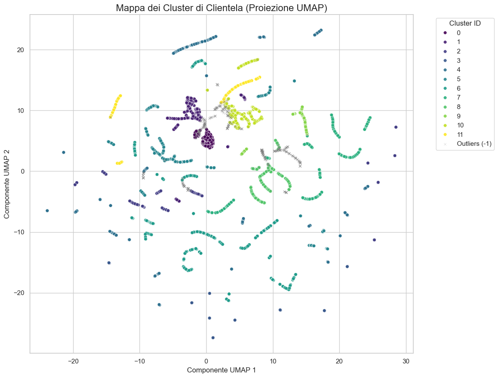
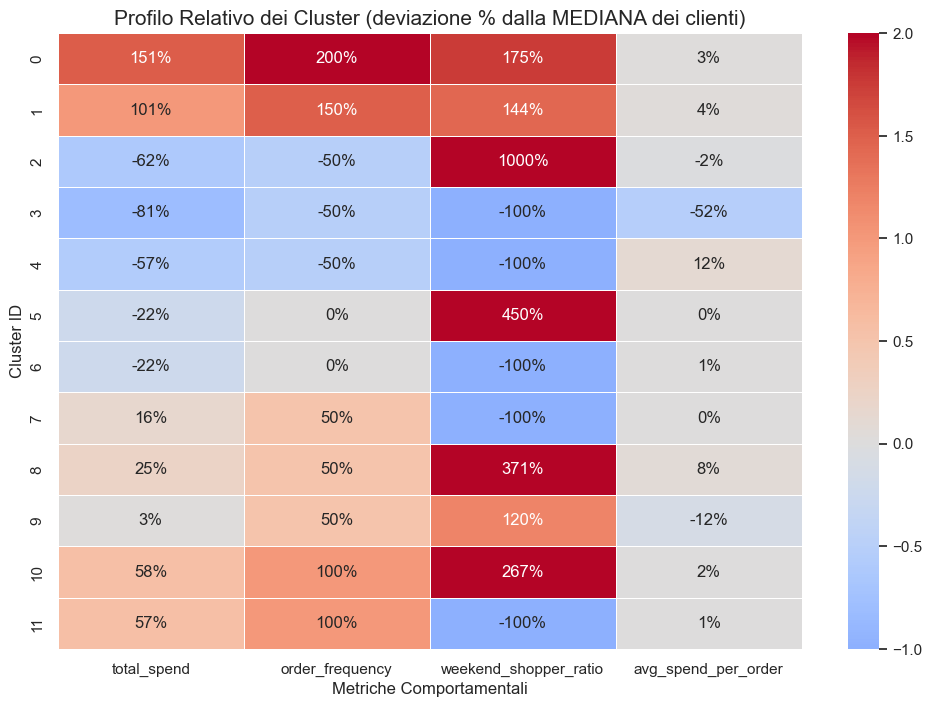

# Analisi e Segmentazione della Clientela per una Pizzeria

**Autore:** Valerio Lapiello | **Data:** Settembre 2025 | **LinkedIn:** [Link al profilo](https://www.linkedin.com/in/valerio-lapiello-597801377/)

---

### ► Panoramica del Progetto

Questo repository contiene un progetto di data science end-to-end che simula una **consulenza strategica** per un'attività di ristorazione fittizia. L'obiettivo è analizzare un anno di dati transazionali per segmentare la clientela, identificare pattern di comportamento e formulare raccomandazioni di business data-driven per migliorare la retention e la profittabilità.

---

### ► Problema di Business

L'azienda cliente necessitava di superare una visione aggregata delle vendite per comprendere in profondità la propria base clienti. Il progetto risponde a domande strategiche fondamentali:
* Chi sono i clienti di maggior valore e come possiamo fidelizzarli?
* Qual è il profilo del cliente "medio" e quali opportunità di crescita rappresenta?
* Esistono segmenti di clientela a rischio di abbandono e quali sono le potenziali cause?

---

### ► Stack Tecnologico e Metodologia

Il progetto è stato sviluppato interamente in **Python** all'interno di un ambiente Jupyter Lab. Le principali librerie utilizzate includono:
* **Analisi e Manipolazione Dati:** Pandas, NumPy
* **Machine Learning:** Scikit-learn, HDBSCAN, UMAP
* **Visualizzazione Dati:** Matplotlib, Seaborn

Il flusso di lavoro ha seguito i seguenti passaggi chiave:
1.  **Data Engineering**: Unificazione di dati grezzi da 4 fonti e ingegnerizzazione di un dataset di profili cliente con metriche comportamentali e attributi demografici sintetici.
2.  **Analisi Esplorativa (EDA)**: Studio dei pattern di vendita temporali e delle performance dei prodotti.
3.  **Clustering**: Applicazione dell'algoritmo **HDBSCAN** dopo averne giustificato la scelta tramite analisi della struttura dei dati (Boxplot, PCA vs UMAP).
4.  **Profilazione e Investigazione**: Analisi quantitativa e qualitativa dei cluster per definirne le "personas" e investigazione mirata sui segmenti a rischio.

---

### ► Risultati Chiave e Visualizzazioni

L'analisi ha identificato **4 macro-segmenti strategici** con caratteristiche e necessità distinte:

1.  **Il Nucleo Mainstream (54%)**: La base di clienti occasionali.
2.  **I Clienti Fedeli (25%)**: Il segmento più prezioso in termini di Customer Lifetime Value (CLV).
3.  **I Clienti a Rischio Abbandono (9%)**: Un gruppo critico di clienti "mono-visita".
4.  **Gli Outlier (11%)**: Casi unici con comportamenti anomali.

#### Mappa dei Segmenti di Clientela
*La visualizzazione UMAP ha rivelato una struttura complessa del mercato, validando la scelta di un modello density-based.*

#### Profilo Comparativo dei Cluster
*La heatmap ha permesso di identificare le caratteristiche distintive di ogni cluster rispetto al cliente "medio".*

---

### ► Raccomandazioni Strategiche

Le conclusioni dell'analisi hanno portato a tre raccomandazioni prioritarie:
1.  **Proteggere i Clienti Fedeli** con un programma di loyalty.
2.  **Intervenire sui Clienti a Rischio** con una revisione dell'offerta entry-level e un'analisi dell'esperienza-cliente nel weekend.
3.  **Aumentare la Profittabilità del Mainstream** con strategie di upselling a basso impatto.

---

### ► Come Utilizzare Questo Repository

1.  Clonare il repository: `git clone [URL_DEL_TUO_REPOSITORY]`
2.  Creare un ambiente virtuale e installare le dipendenze: `pip install -r requirements.txt`
3.  Il report completo, con codice e commenti, è disponibile nel file: `consulenza-clustering.ipynb`
4.  Una versione statica del report è disponibile qui: `report_pizzeria_finale.html`
